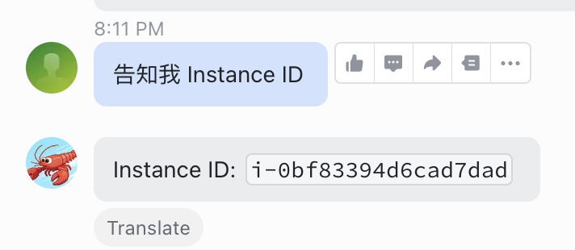
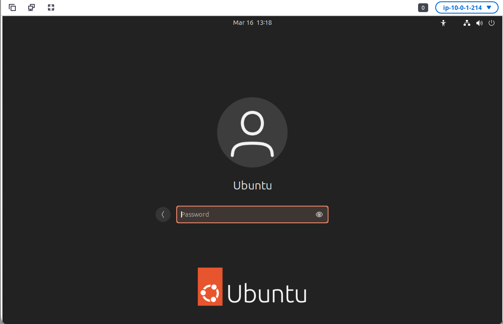

# Amazon DCV Server 自动安装指南 — Ubuntu 24.04

> 本文档供 AI Agent（如 OpenClaw）读取并在本机自动执行，部署 Amazon DCV Server 实现远程桌面访问。
>
> 参考: [AWS 官方文档](https://docs.aws.amazon.com/dcv/latest/adminguide/setting-up-installing-linux-server.html)

## ⚙️ Agent 执行指引（OpenClaw 请先读此段）

> **本段是给你（执行 Agent）的操作规范，不是给人类用户看的文档。请严格遵循。**

### 第一步：通读全文，理解全貌

在执行任何命令之前，请先完整阅读本文档所有章节（Step 1 ~ Step 6），理解：
- 目标：在 Ubuntu 24.04 上安装 Amazon DCV Server，实现通过 SSM Port Forwarding 的远程桌面访问
- 核心脚本：`install-dcv-ubuntu24.sh`（一键安装，位于本文档同目录下）
- 安装后必须重启服务器，Agent 会断连 1-2 分钟
- Step 4-6 涉及用户本地操作（获取 Instance ID、SSM 端口转发、浏览器访问），Agent 需输出指引信息
- 最终验收标准：DCV 服务 `active (running)` + 端口 8443 监听 + DCV 会话存在

### 第二步：检查当前环境状态

通读完成后，先执行以下诊断命令，收集当前状态：

```bash
# 1. 操作系统版本
lsb_release -d 2>/dev/null || cat /etc/os-release | grep PRETTY_NAME

# 2. CPU 架构
ARCH=$(uname -m)
echo "架构: $ARCH"

# 3. DCV Server 是否已安装
dpkg -l nice-dcv-server 2>/dev/null | grep -q "^ii" && echo "DCV_INSTALLED" || echo "DCV_NOT_INSTALLED"

# 4. DCV 服务状态
systemctl is-active dcvserver 2>/dev/null || echo "DCV_SERVICE_NOT_RUNNING"

# 5. 端口 8443 是否在监听
ss -tlnp | grep 8443 >/dev/null 2>&1 && echo "PORT_8443_LISTENING" || echo "PORT_8443_NOT_LISTENING"

# 6. DCV 会话是否存在
dcv list-sessions 2>/dev/null || echo "DCV_SESSIONS_UNKNOWN"

# 7. 桌面环境是否已安装
dpkg -l ubuntu-desktop 2>/dev/null | grep -q "^ii" && echo "DESKTOP_INSTALLED" || echo "DESKTOP_NOT_INSTALLED"

# 8. sudo 权限
sudo -n true 2>/dev/null && echo "SUDO_OK" || echo "SUDO_REQUIRES_PASSWORD"
```

### 第三步：根据状态制定分阶段计划

根据诊断结果，将执行拆分为以下阶段。**每个阶段完成后向用户汇报结果，再进入下一阶段：**

| 阶段 | 对应文档 | 前置条件 | 需要用户确认的情况 |
|------|----------|----------|-------------------|
| 阶段 1：环境检查 | 前置条件 | 无 | 非 Ubuntu 24.04 时暂停；无 `sudo` 权限时暂停 |
| 阶段 2：执行安装脚本 | Step 1 | 阶段 1 通过 | DCV 已安装且服务正常时跳过安装，仅验证；**必须询问用户设置密码**；GPU 实例需加 `--gpu` 参数 |
| 阶段 3：重启服务器 | Step 2 | 阶段 2 完成 | DCV 已安装且服务正常时跳过重启；**提前告知用户 Agent 会断连 1-2 分钟** |
| 阶段 4：验证安装 | Step 3 | 重启后重新连接 | DCV 服务未运行时尝试启动；会话不存在时创建 |
| 阶段 5：输出连接信息 | Step 4-6 | 阶段 4 通过 | 获取 Instance ID 并输出完整连接指引给用户 |

### 执行原则

1. **先诊断，后执行** — 不要跳过环境检查直接运行安装脚本
2. **幂等性优先** — DCV 已安装且服务正常时不重复安装，仅验证状态
3. **密码必须用户提供** — 如果用户未指定密码，主动询问，不要跳过或使用默认值
4. **重启前必须告知** — 重启会导致 Agent 断连，必须提前告知用户
5. **遇到异常立即暂停** — 安装脚本报错、服务启动失败等情况，停下来向用户说明
6. **每阶段汇报** — 完成一个阶段后，用简短的 ✅/❌ 汇总该阶段结果，再询问是否继续
7. **始终使用 `--no-reboot`** — 安装脚本加 `--no-reboot` 参数，验证完成后再手动重启

---

## 前置条件（需用户提前完成）

以下操作需要用户提前完成，Agent 无法代为执行：

1. 当前实例为 Ubuntu 24.04 LTS（建议至少 t3.medium）
2. 实例已安装并启用 SSM Agent（Amazon Linux / Ubuntu 官方 AMI 默认已安装）
3. 实例 IAM Role 包含 `AmazonSSMManagedInstanceCore` 策略
4. 用户本地已安装 AWS CLI 和 [Session Manager 插件](https://docs.aws.amazon.com/systems-manager/latest/userguide/session-manager-working-with-install-plugin.html)
5. 如需 GPU 加速，需使用 G4dn / G5 实例并提前安装 NVIDIA 驱动

> 无需在安全组中开放 8443 端口，我们通过 SSM Port Forwarding 安全访问 DCV 桌面。

## 安装流程

整个安装通过 `install-dcv-ubuntu24.sh` 脚本一键完成。脚本位于本文档同目录下。

### Step 1: 执行安装脚本

确认脚本路径后，直接在本机执行：

基本安装（非 GPU 实例）：

```bash
sudo bash install-dcv-ubuntu24.sh --password <密码> --no-reboot
```

GPU 实例安装：

```bash
sudo bash install-dcv-ubuntu24.sh --gpu --password <密码> --no-reboot
```

自定义用户和会话名：

```bash
sudo bash install-dcv-ubuntu24.sh --user <用户名> --session <会话名> --password <密码> --no-reboot
```

> 始终使用 `--no-reboot`，在验证完成后再手动触发重启。
>
> 如果用户未指定密码，请主动询问用户设置一个密码，不要跳过。

### Step 2: 重启服务器

```bash
sudo reboot
```

> 重启后 Agent 会断开连接，需等待约 1-2 分钟后重新连接。请提前告知用户这一点。

### Step 3: 验证安装

重启并重新连接后，依次执行以下检查：

**检查 DCV 服务状态：**

```bash
sudo systemctl status dcvserver --no-pager
```

期望输出包含 `Active: active (running)`。如果不是，执行：

```bash
sudo systemctl start dcvserver
```

**检查端口监听：**

```bash
ss -tlnp | grep 8443
```

期望输出包含 `LISTEN` 和 `8443`。如果无输出，查看日志：

```bash
sudo journalctl -u dcvserver -n 30 --no-pager
```

**检查 DCV 会话：**

```bash
dcv list-sessions
```

期望输出包含一个 console 类型的会话。如果无会话，创建：

```bash
sudo dcv create-session --type=console --owner ubuntu my-session
```

### Step 4: 获取 EC2 Instance ID

所有验证通过后，通过 OpenClaw 获取本机 Instance ID：



将 Instance ID 输出给用户，用于下一步建立 SSM 端口转发。

### Step 5: 通过 SSM Port Forwarding 连接 DCV 桌面

以下操作由用户在本地电脑终端执行（不是在服务器上）。

先设置环境变量：

```bash
export INSTANCE_ID=<Step 4 获取的 Instance ID>
export AWS_REGION=<区域，如 us-west-2>
```

建立 SSM 端口转发，将服务器的 8443 端口映射到本地 8443：

```bash
aws ssm start-session \
  --target $INSTANCE_ID \
  --region $AWS_REGION \
  --document-name AWS-StartPortForwardingSession \
  --parameters '{"portNumber":["8443"],"localPortNumber":["8443"]}'
```

> 保持此终端窗口不要关闭，端口转发会持续运行。

### Step 6: 浏览器访问远程桌面

端口转发建立后，在本地浏览器打开：

```
https://localhost:8443
```


向用户输出完整连接信息：

```
DCV 远程桌面已就绪。

连接步骤：
  1. 在本地终端运行上述 SSM 端口转发命令（保持窗口不关闭）
  2. 浏览器访问: https://localhost:8443

登录凭据：
  用户名: <--user 参数值，默认 ubuntu>
  密码: <安装时设置的密码>

注意: 浏览器会提示证书不受信任（自签名证书），选择继续访问即可。
```

## 脚本参数参考

| 参数 | 说明 | 默认值 |
|------|------|--------|
| `--arch <x86_64\|aarch64>` | CPU 架构 | 自动检测 |
| `--user <username>` | DCV 会话所有者 | `ubuntu` |
| `--password <password>` | 用户登录密码 | 未指定则需手动设置 |
| `--session <name>` | DCV 会话名称 | `my-session` |
| `--no-reboot` | 安装后不自动重启 | 默认自动重启 |
| `--gpu` | 启用 GPU 组件 | 关闭 |
| `--help` | 显示帮助 | — |

## 脚本执行内容

脚本自动完成以下操作，无需手动干预：

| 步骤 | 操作 |
|------|------|
| 1 | 安装 `ubuntu-desktop` + `gdm3` 桌面环境 |
| 2 | 禁用 Wayland 协议（DCV 不支持） |
| 3 | 配置 X Server，非 GPU 实例自动安装 XDummy 驱动 |
| 4 | 导入 Amazon DCV GPG 签名密钥 |
| 5 | 下载并安装 DCV Server、Web Viewer、虚拟会话支持 |
| 6 | GPU 模式额外安装 nice-dcv-gl |
| 7 | 启用 dcvserver 开机自启，配置自动 console session |
| 8 | 设置用户密码，配置 UFW 防火墙放行 8443 |

## 故障排查

| 症状 | 排查命令 | 处理方式 |
|------|----------|----------|
| DCV 服务未运行 | `sudo journalctl -u dcvserver -n 50 --no-pager` | 根据日志定位错误 |
| 8443 端口未监听 | `ss -tlnp \| grep 8443` | `sudo systemctl restart dcvserver` |
| 无 DCV 会话 | `dcv list-sessions` | `sudo dcv create-session --type=console --owner ubuntu my-session` |
| X Server 未运行 | `ps aux \| grep X \| grep -v grep` | `sudo systemctl isolate multi-user.target && sudo systemctl isolate graphical.target` |
| Wayland 未禁用 | `grep WaylandEnable /etc/gdm3/custom.conf` | 应含 `WaylandEnable=false`，否则手动添加后 `sudo systemctl restart gdm3` |
| SSM 端口转发失败 | `aws ssm describe-instance-information --filters Key=InstanceIds,Values=<Instance-ID>` | 确认实例 SSM Agent 在线，IAM Role 包含 `AmazonSSMManagedInstanceCore` |
| localhost:8443 无法访问 | 确认 SSM 端口转发终端仍在运行 | 重新执行 `aws ssm start-session` 命令 |

## 参考链接

- [Amazon DCV 管理员指南 - Linux 安装](https://docs.aws.amazon.com/dcv/latest/adminguide/setting-up-installing-linux-server.html)
- [Amazon DCV 前提条件](https://docs.aws.amazon.com/dcv/latest/adminguide/setting-up-installing-linux-prereq.html)
- [Amazon DCV 安装后检查](https://docs.aws.amazon.com/dcv/latest/adminguide/setting-up-installing-linux-checks.html)
- [Amazon DCV 客户端下载](https://download.amazondcv.com)
- [SSM Session Manager 端口转发](https://docs.aws.amazon.com/systems-manager/latest/userguide/session-manager-working-with-sessions-start.html#sessions-start-port-forwarding)
- [安装 Session Manager 插件](https://docs.aws.amazon.com/systems-manager/latest/userguide/session-manager-working-with-install-plugin.html)
